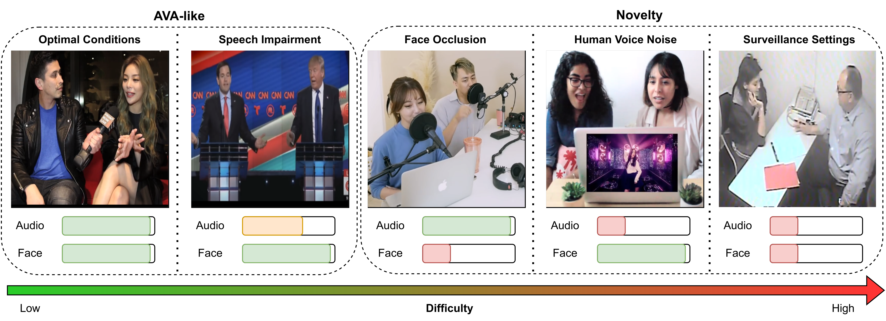
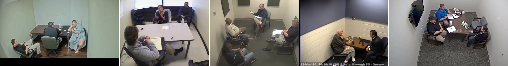
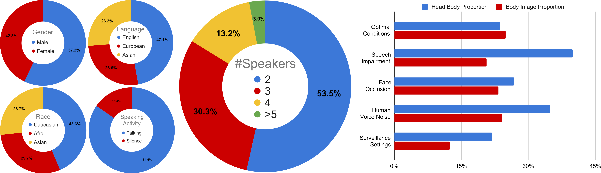
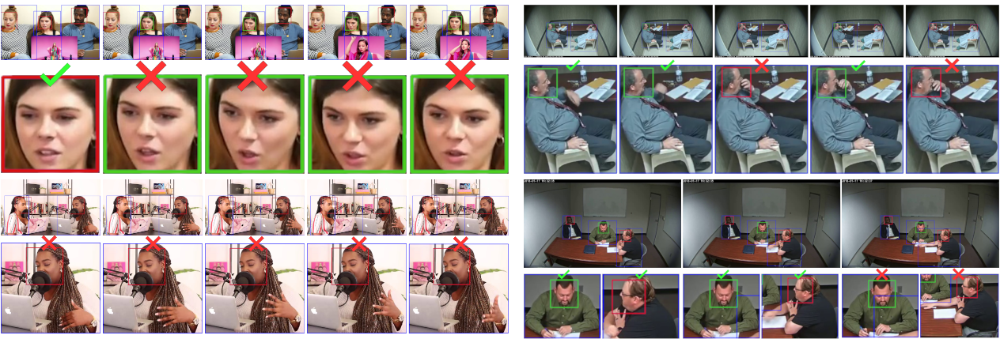
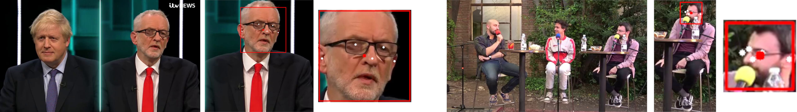

**Wilder Active Speaker Detection (WASD)** dataset has increased difficulty by targeting the two key components of current Active Speaker Detection: audio and face. Grouped into **5 categories**, ranging from optimal conditions to surveillance settings, WASD contains incremental challenges for Active Speaker Detection with tactical impairment of audio and face data. 


*Considered categories of WASD, with relative audio and face quality represented. Categories range from low (Optimal Conditions) to high (Surveillance Settings) ASD difficulty by varying audio and face quality. Easier categories contain similar characteristics to AVA-ActiveSpeaker (AVA-like), while harder ones are the novelty of WASD.*


## Categories

*   **Optimal Conditions**: People talking in an alternate manner, with minor interruptions, cooperative poses, and face availability;


*   **Speech Impairment**: Frontal pose subjects either talking via video conference call (Delayed Speech) or in a heated discussion, with potential talking overlap (Speech Overlap), but ensuring face availability;


*   **Face Occlusion**: People talking with at least one of the subjects having partial facial occlusion, while keeping good speech quality (no delayed speech and minor communication overlap);


*   **Human Voice Noise**: Communication between speakers where another human voice is playing in the background, with face availability and subject cooperation ensured;


*   **Surveillance Settings**: Speaker communication in scenarios of video surveillance, with varying audio and image quality, without any guarantee of face access, speech quality, or subject cooperation.




## Statistics

The maximum length for each video is 15 minutes and each subvideo is segmented up to **30 seconds**, with FPS ranging from 24 to 30. Regarding the number of videos, WASD is composed of **164 videos**, totalling **30 hours** of video annotations,  divided into train and test with a similar proportion to AVA-ActiveSpeaker (80/20), with each category having the same amount of hours (i.e., **6 hours**) and demographics balance. Below we show the demographics and statistics of WASD:


*Gender, language, race, speaking activity, and number of speakers distribution of WASD. Afro refers to African and Afro American people. On the right, distribution of head-body and body-image proportions of WASD categories. WASD is a balanced demographics dataset, with talking being the predominant speaking activity, mainly composed of few people conversations, where audio impaired categories (Speech Impairment and Human Voice Noise) have speakers closer to the camera, and Surveillance Settings has speakers further from it.*

Regarding the considered languages, we group them as follows:
* __English__: English (USA and UK);
* __European__: Croatian, Dutch, French, German, Italian, Portuguese, Russian, and Spanish;
* __Asian__: Chinese, Japanese, Korean, Pakistanese, and Vietnamese.

## State-of-the-art Results

#### AVA-ActiveSpeaker Train

Comparison of AVA-ActiveSpeaker trained state-of-the-art models on AVA-ActiveSpeaker and categories of WASD, using the mAP metric. We train and evaluate each model following the authors’ implementation. OC refers to Optimal Conditions, SI to Speech Impairment, FO to Face Occulsion, HVN to Human Voice Noise, and SS to Surveillance Settings. AVA refers to AVA-ActiveSpeaker.

| Model        | AVA       | OC        | SI        | FO        | HVN       | SS        |
|:-------------|:---------:|:---------:|:---------:|:---------:|:---------:|:---------:|
| ASC [\[1\]](https://github.com/fuankarion/active-speakers-context) | 83.6      | 86.4      | 84.8      | 69.9      | 66.4      | 51.1      |
| MAAS [\[2\]](https://github.com/fuankarion/MAAS)                   | 82.0      | 83.3      | 81.3      | 68.6      | 65.6      | 46.0      |
| TalkNet [\[3\]](https://github.com/TaoRuijie/TalkNet-ASD)      | 91.8      | 91.6      | 93.0      | 86.4      | 77.2      | 64.6      |
| ASDNet [\[4\]](https://github.com/okankop/ASDNet)      | 91.1      | 91.1      | 90.4      | 78.2      | 74.9      | 48.1      |

#### WASD Train

Comparison of state-of-the-art models on the different categories of WASD, using the mAP metric. OC refers to Optimal Conditions, SI to Speech Impairment, FO to Face Occulsion, HVN to Human Voice Noise, and SS to Surveillance Settings.

| Model        | OC        | SI        | FO        | HVN       | SS        |
|:-------------|:---------:|:---------:|:---------:|:---------:|:---------:|
| ASC [\[1\]](https://github.com/fuankarion/active-speakers-context)         | 91.2      | 92.3      | 87.1      | 66.8      | 72.2      |
| MAAS [\[2\]](https://github.com/fuankarion/MAAS)        | 90.7      | 92.6      | 87.0      | 67.0      | 76.5      |
| TalkNet [\[3\]](https://github.com/TaoRuijie/TalkNet-ASD)     | 95.8      | 97.5      | 93.1      | 81.4      | 77.5      |
| ASDNet [\[4\]](https://github.com/okankop/ASDNet)      | 96.5      | 97.4      | 92.1      | 77.4      | 77.8      |

#### WASD *vs* AVA-ActiveSpeaker Train

We assess the average performance (mAP) variation of the four models on WASD categories, when trained on AVA-ActiveSpeaker (AVA) and WASD in the following figure:


When trained in WASD, models can not improve their performance in the presence of disruptive/distracting human voice background (Human Voice Noise), which shows the limitations of current approaches. Furthermore, the disparity between the results with human voice background or surveillance settings and the other scenarios (75% *vs* >92%) shows the limitations of current models to perform in wilder ASD contexts, particularly in impaired audio conditions.

## Qualitative Analysis

We analyze different scenarios where WASD is distinctive from AVA-ActiveSpeaker and body data analysis is more relevant for ASD, namely in Human Voice Noise, Face Occlusion, and Surveillance Settings, in the following figure. Head boxes are colored with models predictions, trained in WASD: green, person is talking; red, not talking. Figures are accompanied with zoom ins containing wrong and correct signs, displaying the correctness of ASD prediction.


*Incorrect model inference in different scenarios. Source of misconception: (top left) awe expression, with sudden and subtle mouth movement, while having human voice in the background; (bottom left) partial facial occlusion from scene object; (top right) slight mouth occlusion from hand movement; and (bottom right) hand and arm movement (from right speaker, better viewed with zoom in) suggest a change in conversation between the two speakers, whose analysis would aid understanding speaker swap mid conversation.*


## Download Dataset

1. Download the content of the [Dataset Github](https://github.com/Tiago-Roxo/WASD) repository;
2. Execute `python3 prepare_setup.py` to create the `WASD` directory and necessary subfolders;
3. Execute `python3 create_dataset.py` to extract audio and face data;
    1. (OPTIONAL) If you want to obtain body data, execute `python3 create_dataset.py --body`;

In the end you should have the following directory structure:
```bash
|-- WASD
|   |-- clips_audios
|   |   |-- ...
|   |-- clips_videos
|   |   |-- ...
|   |-- clips_videos_body
|   |   |-- ...
|   |-- csv
|       |-- train_body_loader.csv
|       |-- train_body_orig.csv
|       |-- train_loader.csv
|       |-- train_orig.csv
|       |-- val_body_loader.csv
|       |-- val_body_orig.csv
|       |-- val_loader.csv
|       |-- val_orig.csv
|   |-- orig_videos
|   |   |-- ...
|   |-- orig_audios
|   |   |-- ...
|   |-- WASD_videos
|   |   |-- ...
|-- convert_dataset.py
|-- create_dataset.py
|-- prepare_setup.py
```
The following folders are not necessary for ASD and can be deleted (if you want) from the `WASD` folder:
* `orig_videos`;
* `orig_audios`;
* `WASD_videos`.

(OPTIONAL) If you wish to use the dataset in a format compatible with ASC, ASDNet, and MAAS, execute `python3 convert_dataset.py`. 

 **Note: This will change the WASD folder to this format.** If you want to have both formats available, do a backup of the original `WASD`.


## Evaluate Models on WASD

To evaluate models we use the official implementation to compute active speaker detection on AVA-ActiveSpeaker, available in the [WASD GitHub repository](), using the following command:

```bash
python3 -O WASD_evaluation.py -g $GT -p $PRED
```
where `$GT` is the groundtruth CSV (*val_orig.csv* of WASD) and `$PRED` is the predictions of your ASD model (usually it is called *val_res.csv*). The execution of `WASD_evaluation.py` requires the presence of `dataset_division.txt`, for category division. The output is the mAP for the 5 WASD categories.


## Annotations

#### Format

We use the same annotation format as the one used by AVA-ActiveSpeaker [\[github\]](https://github.com/cvdfoundation/ava-dataset) [\[website\]](https://research.google.com/ava/download.html#ava_active_speaker_download).
Each row in the CSV files contains an annotation for speaking activity associated with a single face for that frame. Different persons are described in separate rows. The format of a row is the following: video_id, frame_timestamp, entity_box, label, entity_id.

* __video_id__: YouTube identifier with timestamp
* __frame_timestamp__: in seconds from the start of the video.
* __entity_box__: top-left (x1, y1) and bottom-right (x2,y2) normalized with respect to frame size, where (0.0, 0.0) corresponds to the top left, and (1.0, 1.0) corresponds to bottom right.
* __label__: label for the entity specified at that frame. This will be one of {SPEAKING_AUDIBLE, NOT_SPEAKING}.
* __entity_id__: a unique string allowing this box to be linked to other boxes depicting the same person in adjacent frames of this video.

For body annotations, we create another csv, with the same format, where the __entity_box__ relates to the coordinates of the body bounding box.

#### Body Bounding Box

Body bounding boxes drawing and tracking are obtained using YOLOv5 and DeepSort and were manually revised and adjusted via [Computer Vision Annotation Tool](https://github.com/opencv/cvat) (CVAT).

#### Head Bounding Box

Body bounding boxes serve as input to [Alphapose](https://github.com/MVIG-SJTU/AlphaPose), which outputs pose information for each subject per frame. Then, we obtain face bounding boxes from pose data [\[5\]](https://github.com/Tiago-Roxo/YinYang-Net), using eyes, ears, and nose keypoints as reference for bounding box drawing. The size of face bounding boxes is based on body bounding box height, which is adjusted manually per video to ensure adequate face capture. Similar to body, all annotations were manually revised and adjusted via CVAT. The following figures display examples of reference points used and head bounding box drawing in different scenarios.


*(a) Close and (b) Far frontal.*


*(c) Close and (d) Far sideways.*

From left to right, all images contain the original scenario, head bounding box drawing, and zoom in for better visualization. White dots refer to the reference points used for head bounding box drawing, while the red dot is the head's central point. This approach is suitable for various conditions such as close or far frontal poses (*a* and *b*), even with facial occlusion, and in side poses at closer or farther positions (*c* and *d*, respectively).


## Cite

```bibtex
@article{roxo2023wasd,
    title={WASD: A Wilder Active Speaker Detection Dataset},
    author={Roxo, Tiago and Costa, Joana C and In{\'a}cio, Pedro RM and Proen{\c{c}}a, Hugo},
    journal={arXiv preprint arXiv:2303.05321},
    year={2023}
}
```
